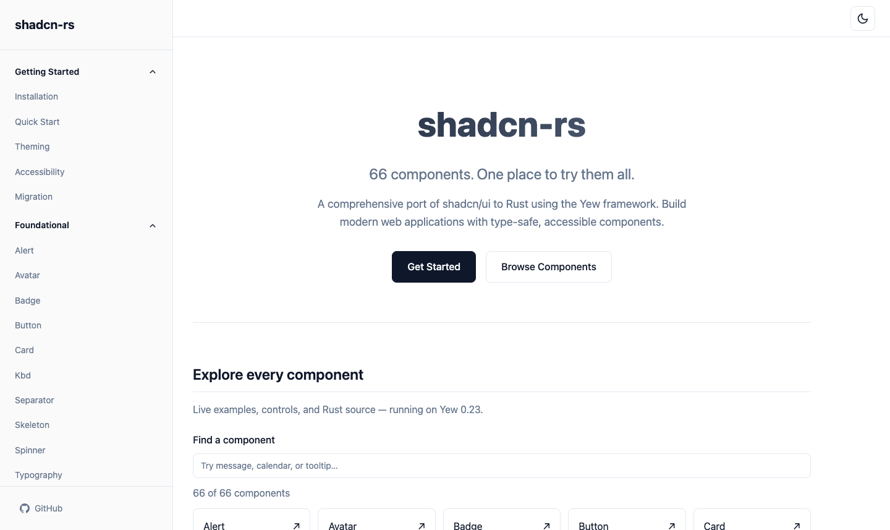

# shadcn-rs Showcase

This directory contains the runnable Yew application for exploring the `shadcn-rs` component library. It provides searchable, interactive examples and Rust snippets for all 66 component modules, including forms, navigation, overlays, charts, and conversation components. The examples run in your browser; the chat and questionnaire demos keep their sample state in the page.

`index.html` is Trunk's HTML entry point. The Yew application starts in `src/main.rs`, URL patterns are in `src/routes.rs`, and component pages are in `src/pages/components/`. The shell, navigation, theme switch, and shared example layout are in `src/components/`. Component styles live in `showcase.css` and `../shadcn-rs/styles/`.

## Preview



The home page lists every component. Use the search box to filter the catalog, then open a component page to try its example and inspect the Rust code.

## Requirements

- Rust stable with the `wasm32-unknown-unknown` target
- [Trunk](https://trunkrs.dev/)
- `just` for the repository's task shortcuts

Install the WASM target and Trunk if needed:

```sh
rustup target add wasm32-unknown-unknown
cargo install --locked trunk
cargo install --locked just
```

## Develop and run

From the repository root:

```sh
just serve
```

Open <http://127.0.0.1:8180>. Trunk watches the showcase source and the library's Rust and CSS files and rebuilds as you edit them. The equivalent direct commands are:

```sh
cd shadcn-showcase
trunk serve
```

Use `trunk serve --release` for an optimized development build. Press `Ctrl-C` in the terminal to stop the server.

## Build for production

From the repository root:

```sh
just showcase-build
```

The optimized static app is written to `shadcn-showcase/dist-release/`. To serve that build locally, run this in a second terminal:

```sh
just showcase-preview
```

Open <http://127.0.0.1:8181>. The local preview server serves the production files and falls back to `index.html` for client-side component routes. The release build keeps `wasm-opt` size optimization enabled and supplies the WebAssembly feature flags emitted by modern Rust.

To run the browser smoke check, keep the production preview running and run:

```sh
just showcase-smoke
```

This opens each component route and checks the catalog search, interactive examples, theme switch, and mobile navigation in headless Chrome. It requires Chrome and a matching ChromeDriver on `PATH`; alternatively set `CHROMEDRIVER` to the driver executable. Screenshots and the smoke report are written to `target/showcase-smoke/`.

## Tests and checks

From the repository root:

```sh
just test           # Native unit tests and doctests
just test-browser   # Browser interaction tests in headless Chrome
just fmt-check      # Check Rust formatting
just lint           # Run Clippy with warnings treated as errors
just ci             # Run the main CI checks and production showcase build
```

Browser tests also require `wasm-bindgen-cli` matching the version pinned in `Cargo.lock`, Chrome, and its matching ChromeDriver. See the root [README](../README.md) for library setup and details of the `justfile` recipes.
